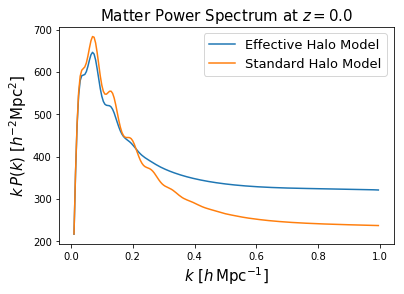

EffectiveHalos: Accurate Models for Matter Power Spectra and Cluster Covariances
=================================================================================

EffectiveHalos is a fast Python code providing models of the real-space matter power spectrum, based a combination of the Halo Model and Effective Field Theory, which are 1\% accurate up to :math:`k = 1h\,\mathrm{Mpc}^{-1}`. It can additionally compute accurate the covariance of halo cluster counts, both and alone and with the matter power spectrum, featuring a model for halo exclusion.

This is based on the work of Philcox, Spergel \& Villaescusa-Navarro (in prep.), and makes use of the CLASS and FAST-PT codes for computing linear and one-loop power spectra respectively.

Authors:

- Oliver Philcox (Princeton)
- David Spergel (Princeton / CCA)
- Francesco Villaescusa-Navarro (Princeton / CCA)

Usage
=======

To compute a matter power spectrum in EffectiveHalos, simply run the following:

.. code-block:: python

    from EffectiveHalos import *
    import numpy as np

    ## Parameters
    z = 0. # redshift
    cs2 = 8. # effective speed of sound (should be calibrated from simulations)
    R = 1. # smoothing scale (should be calibrated from simulations)
    k = np.arange(0.01, 1., 0.005) # wavenumbers in h/Mpc

    ## Load general classes
    cosmology = Cosmology(z, 'Planck18') # use Planck 2018 cosmology
    mass_function = MassFunction(cosmology, 'Bhattacharya') # Bhattacharya 2010 mass function
    halo_physics = HaloPhysics(cosmology, mass_function, 'Duffy', 'NFW') # Duffy 08 concentration relation, NFW halo profiles

    ## Load HaloModel class
    halo_model = HaloModel(cosmology, mass_function, halo_physics, k)

    ## Compute the power spectrum in both Effective and Standard Halo Models
    power_spectrum_EHM = halo_model.halo_model(cs2, R)
    power_spectrum_SHM = halo_model.halo_model(cs2, R, 'Linear', 0, 0, 0)

This generates an estimate for the matter power spectrum in a few seconds. Let's plot this:

A full tutorial is given in :doc:`Tutorial.ipynb`.

.. toctree::
   :maxdepth: 2
   :caption: Contents:

   installation
   api
   Tutorial.ipynb
